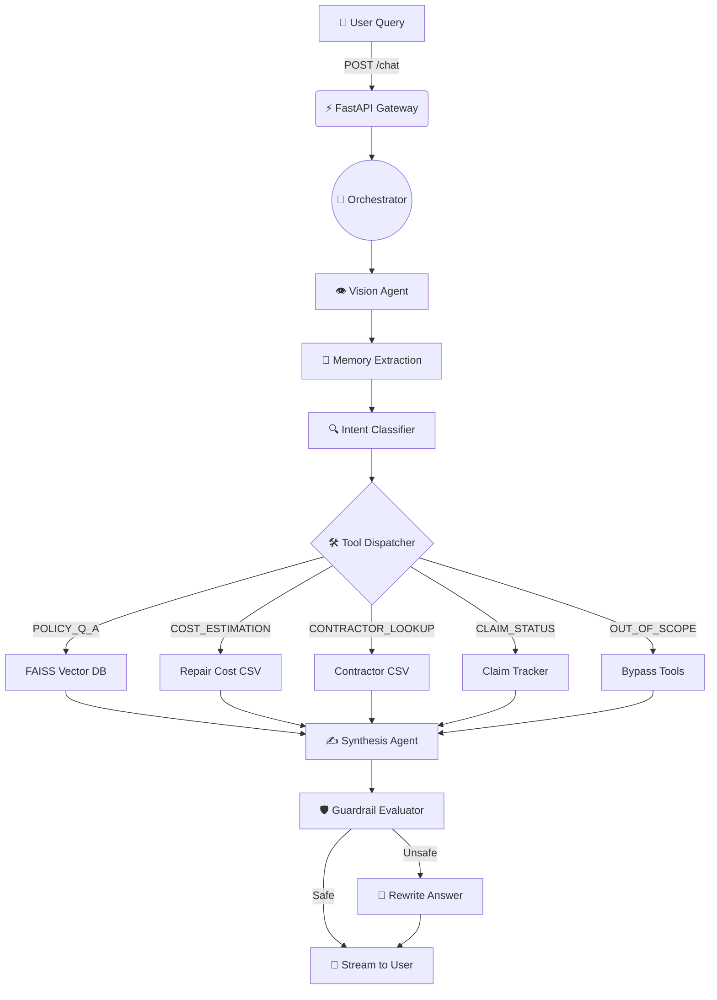

# 🏛️ Property Insurance AI Copilot Architecture

> [!NOTE]
> This document provides a high-level overview of the LangGraph state machine, the dual-memory architecture, the available RAG tools, and the backend event streams that power the real-time UI.

---

## 🌊 1. The Execution Flow (LangGraph)

The core "brain" of the application is a directed graph (State Machine) powered by **LangGraph**. When a user submits a query, it travels through a strict sequence of specialized AI nodes rather than a single monolithic LLM call.



### Flow Breakdown:
1. **Vision Agent**: If the user uploads an image, GPT-4o analyzes it and injects a text description of the damage into the context.
2. **Memory Extraction**: Extracts strict Pydantic variables (e.g., `postcode`, `damage_type`) from the user's text.
3. **Intent Classifier**: Buckets the query into one of 5 strict intents to determine which tool to use.
4. **Tool Dispatcher**: Wakes up the specific Python tool and queries the relevant database (Vector DB or Pandas CSV).
5. **Synthesis Agent**: Merges the user's question, their memory context, and the raw database output to write a human-readable response.
6. **Guardrail Evaluator**: A final safety checkpoint that prevents the AI from making binding financial guarantees.

---

## 🧠 2. Dual-Memory Architecture

The system uses two completely different types of memory to simulate human-like recall.

| Memory Type | Technology | Lifespan | Purpose |
| :--- | :--- | :--- | :--- |
| **Short-Term (Conversational)** | Redis | 24 Hours | Stores raw chat history (User/AI pairs) so the AI understands pronouns (e.g., "What does *it* cover?") and immediate conversational context. |
| **Long-Term (Semantic)** | Mem0 & JSON | Permanent | Actively uses an LLM to extract and permanently save hard facts about the user (e.g., `[PropertyType: Detached]`) so they don't have to repeat themselves in future sessions. |

---

## 🛠️ 3. RAG Tools Directory

All tools are located in `orchestration/tools.py`. The Orchestrator automatically selects exactly **one** tool per query based on the Intent Classifier.

> [!TIP]
> The AI never uses tools blindly. The Intent Classifier acts as a router, drastically reducing LLM hallucinations by forcing the AI to only look at data relevant to the specific user intent.

### Available Tools:
*   `policy_rag_retriever`: Uses **FAISS** to perform semantic similarity searches over ingested PDFs and Markdown files. Used for general policy questions.
*   `damage_cost_estimator`: Uses **Pandas** to query `PropertyDamage_RepairCostTable.csv`. Requires `damage_type` and `property_category` from Memory.
*   `contractor_network_lookup`: Uses **Pandas** to query `contractor_network.csv`. Requires `postcode` and `trade_type`.
*   `claim_status_tracker`: Mocks an API lookup for an ongoing insurance claim using a strict `claim_id`.

---

## 📡 4. Backend Events (Server-Sent Events)

To prevent the user from staring at a loading spinner while the graph executes, FastAPI streams **Server-Sent Events (SSE)**.

As the graph transitions from node to node, it yields JSON events:
```json
{"type": "step", "content": "Extracting Memory..."}
```
The Streamlit frontend (and the Developer Console) intercepts these events via Javascript/Python and instantly updates the UI, creating the glowing "Live Trace" animations. Finally, the synthesized text is streamed token-by-token:
```json
{"type": "token", "content": "Your "}
{"type": "token", "content": "deductible "}
{"type": "token", "content": "is "}
```
